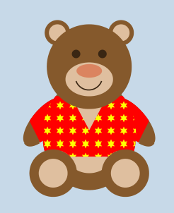

# bearwear - A package for tikz bear fashion

Idea: Bär, Implementation: Ulrike Fischer 2020

## INSTALLATION

Get bearwear with the package manager of your tex system. 

If you want to install manually instead
download bearwear.dtx and bearwear.ins and run TeX/LaTeX on bearwear.ins to unpack the dtx.
Put the extracted bearwear.sty in tex/latex/bearwear/ and update the filename database.

The dtx-file contains the documentation, it should at best be compiled with lualatex.

## DOCUMENTATION

bearwear.pdf. 

## DESCRIPTION

This package offers commands to design shirts for a tikzbear.

## REQUIREMENTS
It needs a recent version of pgf and the tikzlings-bears package. 
